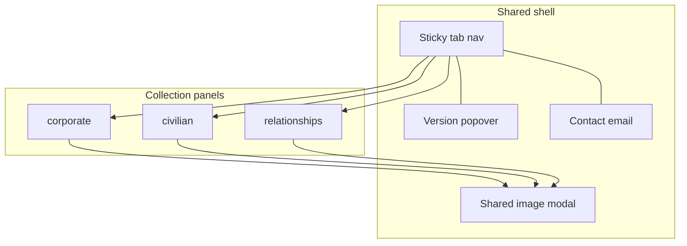

# Satyre — Architecture & Design

**Status:** Living document  
**Last updated:** September 18, 2026  
**Companion:** [PRODUCT_VISION_AND_REQUIREMENTS.md](./PRODUCT_VISION_AND_REQUIREMENTS.md)

## 1. Overview

Satyre is a **static** front-end: HTML structure, CSS presentation, vanilla JavaScript behavior, and PNG assets. There is no build pipeline, bundler, framework, or backend. Delivery is GitHub Pages from the `main` branch root with custom domain `satyre.xyz` via `CNAME`.

## 2. Repository layout

| Path | Responsibility |
| --- | --- |
| `index.html` | Markup: nav, three tab panels, cards, footer, modal shell |
| `style.css` | Tokens, layout, gallery, cards, evening theme, modal/popover |
| `script.js` | Tabs, animations, lightbox (incl. pending state), version popover, time-of-day theme |
| `images/` | Cartoon PNGs and brand imagery |
| `CNAME` | GitHub Pages custom domain |
| `README.md` | Short public overview + local/deploy notes |
| `docs/` | Product and architecture living documents |
| `.cursor/rules/` | Agent rules (including keep-docs-updated) |

## 3. Runtime architecture

### 3.1 Shared shell

- **Nav** (`.tab-nav`): sticky; start = author thumbnail; center = tab buttons; end = version control + mailto.
- **Tabs:** `[data-tab-target]` buttons toggle `.tab-panel` visibility (`hidden` / `.is-active`) and `aria-selected`.
- **Version:** `SITE_VERSION` in `script.js` populates the popover (version, notes, `deployedLabel` with timezone).
- **Modal:** single `#image-modal` for enlarged cartoons and Relationship “Illustration forthcoming” state.

### 3.2 Collection panels

Each panel: `header.hero` + `main.page-body` → `.gallery-grid` of `.card` articles.

**Satire cards (corporate / civilian)**

- Visible `` + `.card-copy` (`h3` + series `
`).
- Click on `.card img` (or `.author-thumbnail`) → `openImageModal`.

**Chronicle cards (relationships)**

- `.card.card--chronicle` with `data-open-cartoon`, optional `data-cartoon-pending`, `data-cartoon-src`, `data-cartoon-title`.
- No visible cartoon on the card; text + “View cartoon” affordance.
- Click / Enter / Space → `openCartoonFromCard` (image or pending UI).

### 3.3 Asset naming

| Prefix | Collection |
| --- | --- |
| `cartoon_co_*.png` | Corporate (newer series); older pieces may use `cartoonN.png` |
| `cartoon_ci_*.png` | Civilian |
| `cartoon_re_*.png` | Relationship Chronicles |

Newest work is **prepended** in the grid (first row = latest).

### 3.4 Presentation design

- **Fonts:** Inter (UI/body), Playfair Display (display titles), Space Mono (small labels).
- **Tokens:** CSS variables in `:root` (`--bg`, `--panel`, `--text`, `--muted`, `--accent`, `--shadow`).
- **Grid:** 1 column default; 2 from 640px; 3 from 1024px.
- **Cards:** Shared shell; colored `border-top` modifiers (`card--co-*`, `card--ci-*`, `card--re-*`).
- **Evening theme:** `body.evening` when local hour ≥ 18 or &lt; 7.
- **Congruence rule:** New collections reuse chrome and card shell; only content pattern may diverge (e.g. verbiage-first).

### 3.5 Interaction design

| Concern | Behavior |
| --- | --- |
| Tab switch | Update active button/panel; re-run `animateCards` on active panel |
| Lightbox open | Lock body scroll; focus close control |
| Lightbox close | Backdrop, ×, or Escape; clear image/pending state |
| Version popover | Toggle on info button; outside click / Escape closes |
| Chronicle pending | Hide modal image; show `#image-modal-pending` with title + “Illustration forthcoming” |

## 4. Delivery & release

1. Change content/code on a branch; merge to `main`.
2. GitHub Pages publishes static files from repo root.
3. On noticeable ship: update `SITE_VERSION` (`version`, `notes`, `deployedLabel` with timezone).
4. Update living docs under `docs/` (enforced by Cursor rules).

## 5. Extension guidelines

When adding a piece:

1. Drop PNG into `images/` with the correct prefix.
2. Prepend a card in the matching panel in `index.html`.
3. For chronicles: set `data-cartoon-src`; remove `data-cartoon-pending` when the art is ready.
4. Add a border-top modifier in `style.css` if introducing a new accent class.
5. Bump `SITE_VERSION` and refresh `docs/` + README if behavior or collections change.

When adding a collection:

1. New tab button + panel id.
2. Reuse grid/card/modal patterns; document product requirements and this architecture.
3. Prefer extending `script.js` handlers over new dependencies.

## 6. Out of scope (architecture)

- Build tools, npm packages (except none today), SSR, or API layers
- Client-side routing libraries
- Image CDN or processing pipeline (raw PNGs in-repo)

## 7. Document maintenance

This file is kept current by project Cursor rules whenever structure, interactions, naming, delivery, or design tokens change. Update **Last updated** when revising.
